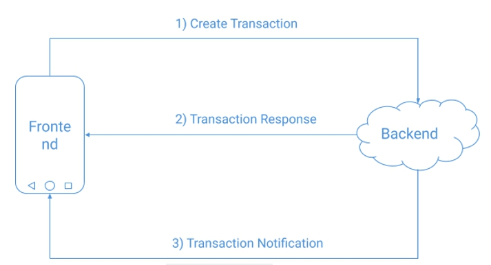

# **Get Started**
## **Requirement**

- API Level: Minimum API level supported by SDK is 21 (Lollipop)

## **Installation**
To integrate you app with Mika SDK, you need to put `mikaSdk.aar` file under `libs` folder, then add Mika SDK inside your app's `build.gradle` below

```Java
repositories { 
      flatDir {
            dirs 'libs' 
      }
}
dependencies { 
        ...... 
        implementation(name: '', ext: 'aar') 
}
```
Mika SDK is bundled in AAR file format. The AAR file does not contain nested (or [transitive](https://maven.apache.org/guides/introduction/introduction-to-dependency-mechanism.html#Transitive_Dependencies)) dependencies and does not have a **POM File** which describes the dependencies used by the library. Because of these, you need to specify all of the dependencies required by Mika SDK in your project, as below:

```Java
dependencies { 
        ...... 
        implementation 'io.sentry:sentry-android:1.7.316' 
        implementation 'org.jetbrains.kotlin:kotlin-stdlib-jdk7:1.3.30' 
        implementation 'com.scottyab:secure-preferences-lib:0.1.7' 
        implementation 'com.squareup.retrofit2:retrofit:2.4.0' 
        implementation 'com.squareup.retrofit2:converter-gson:2.4.0'
        implementation 'com.squareup.okhttp3:okhttp:3.11.0' 
        implementation 'com.squareup.okhttp3:logging-interceptor:3.11.0' 
        implementation 'org.eclipse.paho:org.eclipse.paho.client.mqttv3:1.2.0' 
        implementation 'org.eclipse.paho:org.eclipse.paho.android.service:1.1.1' 
        implementation 'com.journeyapps:zxing-android-embedded:3.5.0@aar' 
        implementation 'com.google.zxing:core:3.3.0' 
        implementation 'io.sentry:sentry-android:1.7.16' 
        implementation(name: 'PayLib-release-1.4.17', ext: 'aar')
        implementation 'com.sunmi:sunmiui:1.1.27' 
} 
```
`PayLib-release-1.4.17.aar` is an SDK provided by SUNMI. You have to put this file under the `libs` folder. 

Then, to provide permission for **SUNMI PayLib SDK**, you need to add several permissions in `AndroidManifest.xml` file as below: 

```Java

<uses-permission android:name="com.sunmi.perm.MSR"/> 
<uses-permission android:name="com.sunmi.perm.ICC"/> 
<uses-permission android:name="com.sunmi.perm.SECURITY"/> 
<uses-permission android:name="com.sunmi.perm.CONTACTLESS_CARD"/> 

```

## **Initialization**

On `MainApplication` Class, initialized Mika SDK inside the `OnCreate` method.

```Java

MikaSdk.instance.initialize(applicationContext) 

```
## **Transaction Flow**

Transaction flow is a representation of a system's procesessing that were used for funtional testing.



The flow above is a high-level picture of Transaction Flow for this application, with the following steps:
1. Create Transaction: Call `createTrasaction` method to send a request (create transaction) to backend
2. Transaction Response: Handle the backend response with SDK callback
3. Transaction Notification: Backend sends notification to frontend when the transaction status changed (success, failed, voided, expired, pending, error). You have to call `startMqttService` to handle the notification. `startMqttService` is usually initialized before `createTransaction` called.

# **Credential**

## **Login**
To use Mika SDK features, an agent needs to authenticate (a.k.a., login) to Mika Server. Use `login` API to authenticate as below:

- **Kotlin**
```Kotlin

MikaSdk.instance.login(username, password, this.loginCallback)

private val loginCallback = object : LoginCallback { 
      override fun onSuccess(response: LoginResponse) {
            //do anything after successfully login 
      }
      override fun onFailure(errorResponse: BasicResponse) {       
            //do anything if login failed    
      } 
       override fun onError(error: Throwable) {       
            //do anything if error occurs    
      }
} 
 
```
Above is a `login` API written in Kotlin. Here is the same `login` API to authenticate which written in Java:

```Java

MikaSdk.Companion.getinstance().login(username, password, this.loginCallback);

private LoginCallback loginCallback = new LoginCallback() {
      @Override
      public void onSuccess(LoginResponse loginResponse) {
            //do anything after successfully login
      } 
      @Override
      public void onFailure(BasicResponse errorResponse) {
            //do anything if login failed
      } 
      @Override
      public void onError(Throwable error) {
            //do anything if error occurs
      } 
}; 

```

Where the parameters;
- **username** (string): agent username
- **password** (string): agent password

## **Logout**
Use `logout` API to terminates the current user session and disassociates the cached information form `SharedPreferences`. 

- **Kotlin**
```Kotlin

MikaSdk.instance.logout(this.logoutCallback) 

private val logoutCallback = object : LogoutCallback {
      override fun onSuccess(response: BasicResponse) {
            //do anything after successfully logout
      } 
      override fun onFailure(errorResponse: BasicResponse) {
            //do anything if logout failed
      }
      override fun onError(error: Throwable) {
            //do anything if error occurs
      }
} 

```

Above is a `logout` API written in Kotlin. Here is the same `logout` API to authenticate which written in Java:

- **Java**
```Java
MikaSdk.Companion.getinstance().logout(this.logoutCallback); 

private LogoutCallback logoutCallback = new LogoutCallback() { 
      @Override
      public void onSuccess(BasicResponse response) {
            //do anything after successfully logout
      } 
      @Override
      public void onFailure(BasicResponse errorResponse) {
            //do anything if login failed
      }
      @Override
      public void onError(Throwable error) {
            //do anything if error occurs
      }
}; 
```
# **Transaction Features**

## **Create Transaction**
A transacton represents a unique potentially taxable action. The `createTransaction` uses the tax profile of your company to identify the correct tax rules and rates to apply to all line items in the transaction.

- **Kotlin**
```Kotlin
MikaSdk.instance.createTransaction(acquirerId, amount, locationLat, locationLong, this.createTransactionCallback)

private val createTransactionCallback = object : CreateTransactionCallback {
      override fun onSuccess(response: TokenTransaction) {
            //do anything after transaction successfully created
      }
      override fun onFailure(errorResponse: BasicResponse) {
            //Handle failure here
      }
      override fun onError(error: Throwable) {
            //Handle error here
      }
} 
  
```

Above is a `createTransaction` API written in Kotlin. Here is the same `createTransaction` API which written in Java:

- **Java**
```Java
MikaSdk.Companion.getinstance().createTransaction(acquirerId, amount, locationLat, locationLong, this.createTransactionCallback);

private CreateTransactionCallback createTransactionCallback = new CreateTransactionCallback() {
      @Override
      public void onSuccess(TokenTransaction response) {
            //do anything after transaction successfully created
      }
      @Override
      public void onFailure(BasicResponse errorResponse) {
            //Handle failure here
      } 
      @Override
      public void onError(Throwable error) {
            //Handle error here
      }
};
  
```

Where the parameters;
- **acquirerId** (string): ID of selected acquirer
- **amount** (int): Transaction amount
- **locationLat** (String): Latitude of current location
- **locationLong** (String): Longitude of current location

## **Get List of Transaction**
Use `getTransactions` API to see the list of the details of the successful transactions

MikaSdk.instance.getTransactions(order, this.transactionCallback) 

- **Kotlin**
```Kotlin
private val transactionCallback = object : TransactionCallback {
      override fun onSuccess(response: ArrayList<Transaction>) {
            //do anything after transaction successfully retrieved
      }
      override fun onFailure(errorResponse: BasicResponse) {
            //Handle failure here
      }
      override fun onError(error: Throwable) {
            //Handle error here
      }
} 
```

Above is a `getTransactions` API written in Kotlin. Here is the same `getTransactions` API which written in Java:

- **Java**
```Java
MikaSdk.Companion.getinstance().getTransactions(order, this.transactionCallback); 

private TransactionCallback transactionCallback = new TransactionCallback() {
      @Override
      public void onSuccess(ArrayList<Transaction> response) {
            //do anything after transaction successfully retrieved
      }
      @Override
      public void onFailure(BasicResponse errorResponse) {
            //Handle failure here
      }
      @Override
      public void onError(Throwable error) {
            //Handle error here
      }
}; 
```

Where the parameters;
- **oder** (string): asc to sort the list by date with ascending format, or desc to sort the list by date with descending format.
